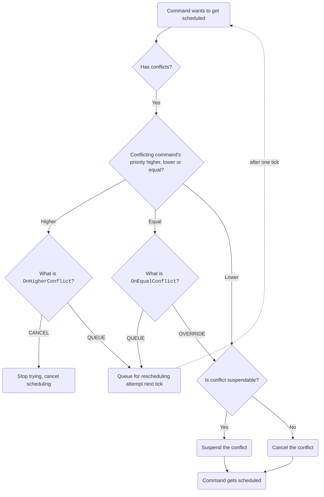

# Conflict resolution

## Overview

Conflict resolution in FTCLib, NextFTC, and similar libraries is very basic.
ducklib introduces a rich priority system,
allowing for easy implementations of input buffering,
default commands,
and more.

To set the `priority` or `OnHigherConflict` or `OnEqualConflict` properties of a command,
check out the [command configuration page](/commands/index.md#configuration).
TL;DR:

```kotlin
val cmd = NoOpCommand().configure {
    priority = 1.priority
    onEqualConflict = OnEqualConflict.QUEUE
    onHigherConflict = OnHigherConflict.CANCEL
}
// or
val cmd = NoOpCommand()
    .setPriority(priority = 1.priority)
    .setOnEqualConflict(OnEqualConflict.QUEUE)
    .setOnHigherConflict(OnHigherConflict.CANCEL)
```

## Situation 1: no conflicts

Say you have a command, `cmd1`, that requires `subsystem1`.
Now, you try to schedule another command, `cmd2`, that requires `subsystem2`.
Since neither of their requirements overlap,
everything goes smoothly, and both commands are scheduled.

## Situation 1: conflicts, but `cmd2` has higher priority

Now, `cmd2` requires `subsystem1`.
Their requirements overlap, so we have a conflict that we need to resolve.

The first step is to compare their priorities.
In this case, `cmd2` has a higher priority than `cmd1`.
This means that no matter what, `cmd2` is going to run.
To do this, `cmd1` will have to be suspended or canceled,
so its [`suspend`](/commands/index.md#suspend-and-resume) function will get called to aid in a smooth handoff,
and `cmd2` will take over control.
When `cmd2` finishes,
assuming `cmd1` got suspended and not canceled,
`cmd1` will get resumed and rescheduled.

What determines whether a command is suspendable or not is the `suspendable` property on `Command`, and is set by the command.

## Situation 2: conflicts, but `cmd2` has lower priority

Again, the first step is to compare their priorities.
In this case, `cmd2` has a lower priority than `cmd1`.
This means that no matter what, `cmd1` is going to finish running.

`cmd2` has two choices:
it can give up,
or it can get queued for later scheduling.
By default the latter is chosen,
although you can set it with one one of the [configuration functions](/commands/index.md#configuration).

## Situation 3: conflicts, but they have equal priority

`cmd1` can't wait,
and `cmd2` can't wait,
so now what happens is determined by the user with one of the configuration functions.
They can either make `cmd2` cancel `cmd1` with `OnEqualConflict.OVERRIDE`,
or make it queue with `OnEqualConflict.QUEUE`.

## Recap

Basically, the flow is this:


